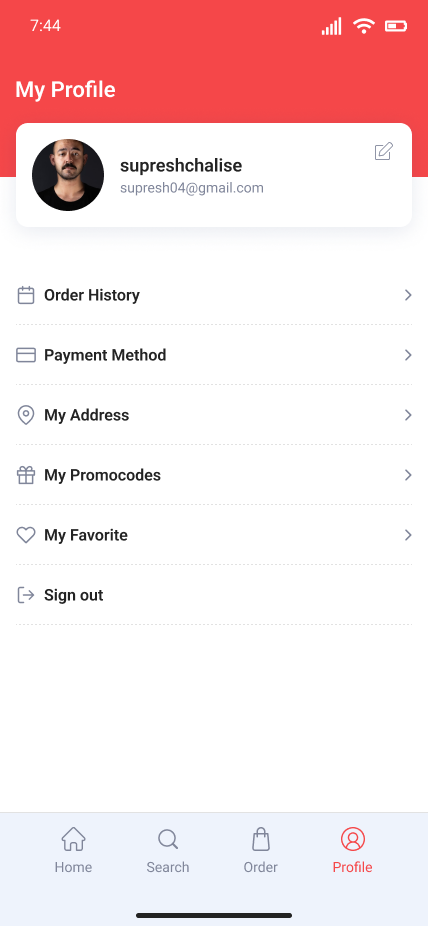

# FoodieApp UI - Figma Design

## Overview

**FoodieApp UI** is a Figma design for a mobile food ordering application. This design provides a user-friendly and visually appealing interface for users to explore restaurants, view menus, place orders, and track deliveries. The design follows modern UI/UX principles, focusing on ease of use and a seamless food ordering experience.

## Features

- **Home Screen**: Displays restaurant categories, featured dishes, and promotional offers.
- **Restaurant Listings**: Shows nearby restaurants with ratings, cuisine types, and filters.
- **Menu Screen**: Allows users to browse menus, view items, and select dishes.
- **Order Summary**: Cart page showing the selected items, prices, and total order amount.
- **Payment Screen**: A simple interface for entering payment details and completing orders.
- **Order Tracking**: Displays real-time order status and delivery tracking.
- **Profile & Settings**: User profile for managing details, preferences, and payment methods.

## Figma Design

The **FoodieApp UI** design has been created using **Figma** and includes various screens to demonstrate the app’s interface.

### Screens Included:

- **Splash Screen**
- **Login/Signup Screen**
- **Home Screen**
- **Restaurant Listings**
- **Menu Screen**
- **Order Summary**
- **Payment Screen**
- **Profile Screen**

## Previews

Here are some screenshots of key screens from the **FoodieApp UI**:

### 1. **Profile Screen**  
View and manage user profile details, including personal information and order history.

### 2. **Add New Card**  
A clean, simple interface for adding new payment cards securely.

### 3. **Order History**  
Track past orders and view order details such as delivery status and total amount.

## Figma Prototype

You can interact with the Figma prototype using the link below:
- [FoodieApp Prototype](https://www.figma.com/proto/euyhszhY6HAJJP5EDqs3N3/Untitled?node-id=5-2)

## Design Guidelines

- **Typography**: Clear, readable fonts to enhance the user experience.
- **Colors**: A vibrant, appetizing color palette that reflects the food and restaurant theme.
- **Buttons**: Large, easy-to-click buttons to support a mobile-first design.
- **Icons**: Custom icons for various features such as cart, menu, profile, etc.

## Contributing

If you’d like to suggest improvements or contribute new screens, feel free to request access or provide your ideas. Contributions are welcome!

## License

The **FoodieApp UI** design is licensed under the **Creative Commons Attribution 4.0 International License**.

---

Let me know if you need anything else!
